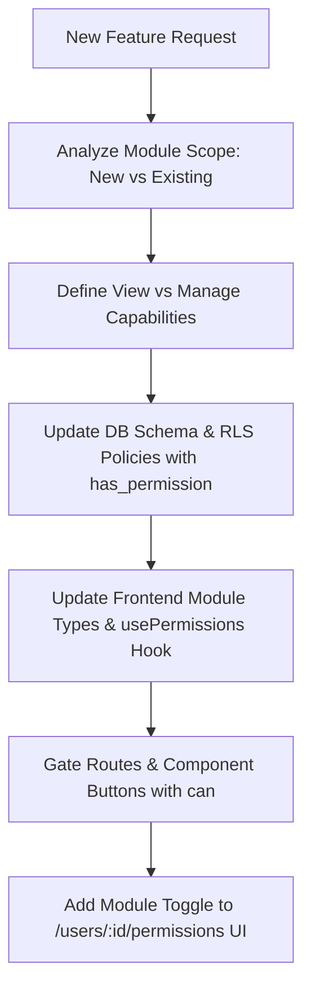

# ABAC Feature & Module Integration Guide (`abac-feature-planner`)

This skill defines the mandatory protocol for extending the application's **Permission-Based / Attribute-Based Access Control (ABAC)** system whenever a new feature, entity, or module is introduced.

---

## 1. Core ABAC Principles

1. **One Super Admin**: Full access to all modules automatically (`is_admin = true`). Never requires explicit rows in `user_permissions`.
2. **Default Zero Access**: New staff users have zero access until an admin explicitly grants module permissions.
3. **Module-Centric Access**: Access is controlled per `module` key at two standardized levels:
   - **`view`**: Read-only access to module data and navigation routes.
   - **`manage`**: Read + Write + Process access (create, edit, update, perform domain actions).
   - *(Note: `can_manage = true` automatically implies `view` capability).*

---

## 2. Feature Request Analysis Questionnaire

Whenever a new feature request or entity is introduced, agents **MUST** analyze it against the following 4-step questionnaire:

### ❓ Question 1: Module Alignment
> *"Does this feature belong to an existing module (`inventory_management`, `issue_management`, `user_management`, `issue_notifications`), or does it introduce a **NEW module**?"*

- If it belongs to an existing module, identify which existing module gates it.
- If it requires a **new module** (e.g. `maintenance_records`, `billing`, `reports_analytics`):
  - Choose a concise `snake_case` module name.

### ❓ Question 2: Scope Boundaries (View vs Manage)
> *"What specific actions are allowed under `view` vs `manage`?"*

Fill out the standard definition table:
| Level | Allowed Capabilities for New Feature |
|---|---|
| **View** | List views, detail pages, read-only stats, filtering |
| **Manage** | Create, edit, state transitions, manual overrides, process actions |

*Is this module a single toggle (like `issue_notifications`) or a full View/Manage pair?*

### ❓ Question 3: Database & RLS Enforcement Plan
> *"Which database tables support this feature, and what RLS policies are needed?"*

1. **Check Constraint**: Add new module key to `user_permissions.module` check constraint if adding a new module.
2. **RLS Policies**:
   ```sql
   -- Select policy (View level)
   create policy "view <table_name>" on <table_name> for select
     using (has_permission('<module_name>', 'view'));

   -- Insert/Update/Delete policy (Manage level)
   create policy "manage <table_name>" on <table_name> for all
     using (has_permission('<module_name>', 'manage'))
     with check (has_permission('<module_name>', 'manage'));
   ```

### ❓ Question 4: Frontend Gating & UI Checklist
> *"How will the frontend enforce these permissions?"*

1. **Type Definitions**: Add module key to `Module` type in `src/types/database.types.ts` / `src/types/permissions.ts`.
2. **Route Guards**: Protect new routes with `<ProtectedRoute module="<module_name>" level="view" />`.
3. **UI Elements**: Wrap action buttons (Add, Edit, Delete, Process) with `if (can('<module_name>', 'manage'))`.
4. **User Permissions Matrix**: Update the permission matrix component (`/users/:id/permissions`) so admins can assign the new module's View/Manage toggles.

---

## 3. Standard Implementation Workflow for New ABAC Modules


